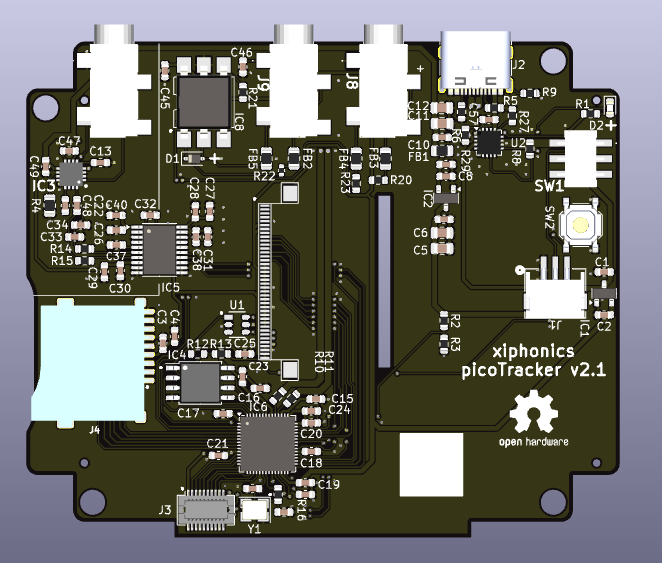

# PCB for PicoTracker
All data in order to fabricate the PCB for the [picoTracker](https://github.com/xiphonics/picoTracker)

Buy the official kit at [xiphonics store](https://xiphonics.com/products/picotracker-pcb-kit)
# Trademark Notice

This repository contains the open-source hardware design files for the picoTracker project.

The hardware design files are released under the CC0 1.0 Universal license and may be used, modified, manufactured, and sold without restriction.

However, the **picoTracker** name, logos, product branding, and associated trademarks are **not** covered by the CC0 license and are not licensed for use by third parties.

You may manufacture and sell hardware derived from these design files, but you may not market, advertise, label, or otherwise represent such products using the "picoTracker" name or branding without prior written permission from Xiphonics.

Products manufactured from these files must be sold under a different product name and must not imply endorsement by, affiliation with, or origin from Xiphonics.

To facilitate this separation, the manufacturing files distributed through this repository intentionally omit picoTracker branding elements.

Use of the picoTracker name in connection with unauthorized derivative hardware may constitute trademark infringement and unfair competition.

